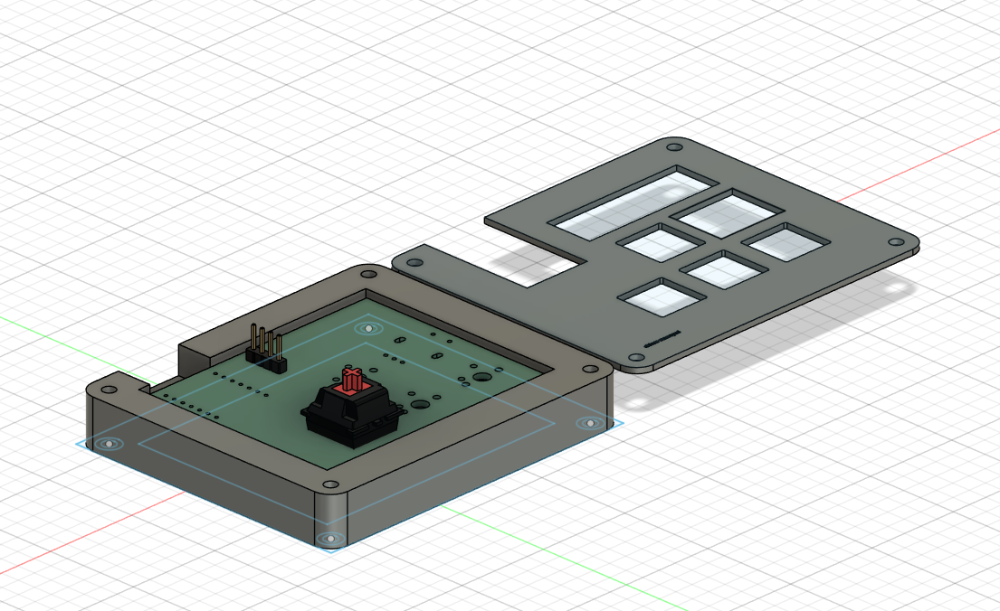
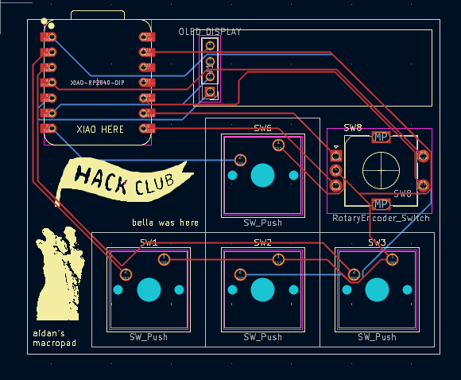
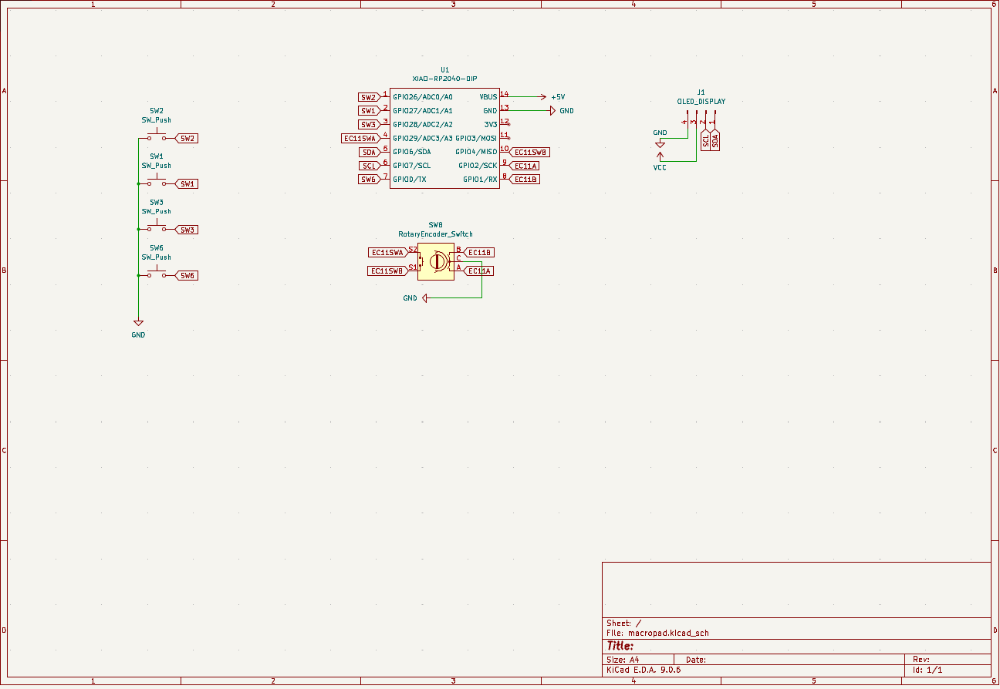
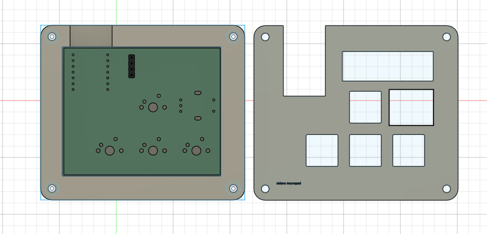

# Aidan's Macropad

## Inspirations

I wanted to be able to build my own macropad and experiment with cadding :)

## Specifications

BOM:

    4x Cherry MX Switches
    1x XIAO RP2040
    4x Blank DSA Keycaps
    1x 0.91" OLED SCREEN
    1x EC11 Rotary Encoder

## Images

### Complete Macropad

### PCB Design

### Schematic

### 3D Printed Case

